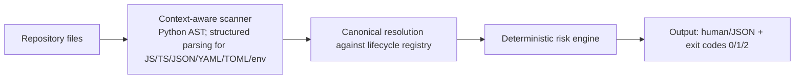
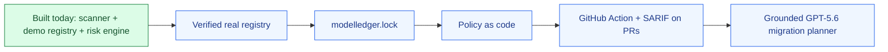

# ModelLedger

Dependabot for AI models — find every model your repository depends on, check a verified lifecycle ledger, and block risky dependencies in CI.

## Run the demo in 60 seconds

```bash
git clone https://github.com/AbdulAliMamnun/modelledger.git
cd modelledger
python3 -m venv .venv
source .venv/bin/activate
pip install -e .
python -m modelledger.cli demo_repository
```

```text
ModelLedger scan: /Users/abdulalimamnun/Documents/modelledger/demo_repository
[LOW] .env.example:1 demo-unknown-v1 (unknown, unknown)
[NONE] app.py:1 demo-active-v1 (ModelLedger Demo Provider, active)
[HIGH] app.py:2 demo-deprecated (ModelLedger Demo Provider, deprecated) -> replace with demo-active-v1
[CRITICAL] config.json:2 demo-retired-v1 (ModelLedger Demo Provider, retired) -> replace with demo-active-v1

4 model reference(s) found.
```

Exit code `1` means CI blocks the retired model automatically.

## The problem

Providers rename, deprecate, and retire models outside your repo. Model IDs are hardcoded strings scattered across source and configuration files. Teams find out when production breaks.

## What works today

- Comment-safe source discovery across Python, JavaScript, TypeScript, JSON, YAML, TOML, and environment templates. Python is parsed with the AST; other formats use conservative, syntax-aware literal extraction.
- A deterministic risk engine classifies active, deprecated, retired, and unknown models.
- CI-friendly exit codes: `1` for critical findings and `2` for input or registry errors (`0` otherwise).
- `--json` for machine-readable output.
- `--registry PATH` for an explicit lifecycle registry.

```bash
python -m modelledger.cli demo_repository --json
python -m modelledger.cli demo_repository --registry path/to/models.yaml
```

The bundled lifecycle records are synthetic demo data and are clearly labeled as such. Common version-control, virtual-environment, dependency, cache, generated-output, and build directories are ignored, along with binary files and symlinks.

## How a scan works



## Design principles

- **Deterministic by design.** Discovery, registry resolution, and risk classification are fully deterministic and auditable — same input, same output, same exit code.
- **Evidence-grounded intelligence.** The planned GPT-5.6 migration planner interprets verified lifecycle evidence and cites official sources; the registry remains the source of truth.
- **Every lifecycle fact has provenance.** Registry records require a source URL and last-verified date; bundled records are explicitly synthetic demo data.
- **Precision over recall.** ModelLedger reports high-confidence dependency references instead of guessing from every string.

## Roadmap



Green marks what is built today; blue marks planned milestones.

## Built with Codex

ModelLedger was built during OpenAI Build Week using Codex in VS Code as the implementation agent. Development was spec-first, driven by explicit milestone prompts. A dedicated `/review` pass surfaced 11 findings—3 high, 5 medium, and 3 low—which were fixed in a remediation cycle. A second review plus an independently executed verification battery gated the first commit, including wheel installation into a clean virtual environment, comment false-positive tests, symlink containment, malformed-registry checks, and exit-code contract checks. Codex was never permitted to commit; every commit was human-reviewed and human-made.

## Known limitations

- Unquoted inline YAML lists of model IDs are not detected.
- Unknown-model detection may flag generic deployment names as low-risk findings. Tuning is deferred until real registry data exists.
